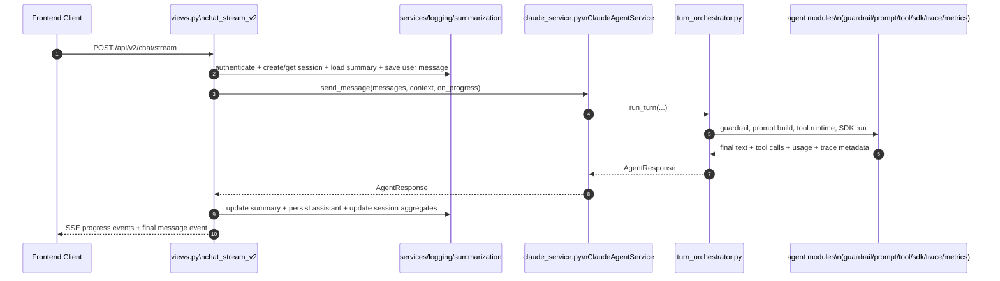
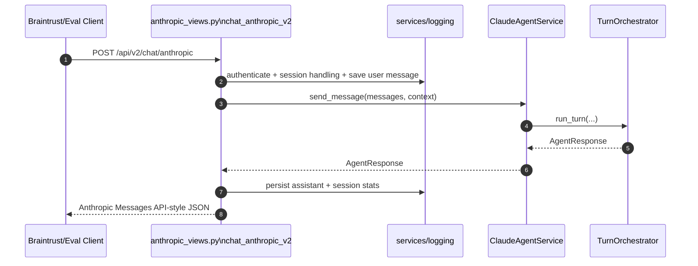

# Architecture

## Overview

LC Chatbot is an embeddable AI assistant for Jewish text learning. The V2 backend uses a layered runtime:

1. API entrypoints in `server/chat/V2/views.py` (SSE) and `server/chat/V2/anthropic_views.py` (Anthropic-compatible JSON).
2. Agent facade in `server/chat/V2/agent/claude_service.py`.
3. Turn orchestration in `server/chat/V2/agent/turn_orchestrator.py`.
4. Specialized agent modules for guardrails, prompt assembly, SDK execution, tool runtime, tracing, and metrics.
5. Persistence/summaries handled outside agent internals (`services/`, `logging/`, `summarization/`).

Core data path:

```text
Svelte Web Component -> Django REST API -> Claude Agent SDK (+ MCP tools) -> Sefaria APIs
```

## Runtime Layers

| Layer | Primary Files | Responsibility |
|---|---|---|
| API Layer | `server/chat/V2/views.py`, `server/chat/V2/anthropic_views.py` | Validate/authenticate request, create/load session, persist user message, call agent, persist final result, return SSE/JSON response |
| Agent Facade | `server/chat/V2/agent/claude_service.py` | Public entrypoint (`send_message`), dependency wiring, Braintrust runtime setup, compatibility exports |
| Turn Orchestration | `server/chat/V2/agent/turn_orchestrator.py` | End-to-end turn control flow: guardrail -> prompt -> tools -> SDK -> metrics/logging |
| Specialized Agent Modules | `server/chat/V2/agent/*.py` | Single-concern modules for prompt/tool/sdk/tracing/metrics/progress/helpers |
| Persistence + Summary | `server/chat/V2/services/`, `server/chat/V2/logging/`, `server/chat/V2/summarization/` | Session/message writes, response logging, rolling conversation summary updates |

## System Flow

### Streaming Endpoint (`POST /api/v2/chat/stream`)

https://mermaid.ai/d/9af27e86-3194-4e3c-8d7f-d62d9b0d6c07




### Anthropic-Compatible Endpoint (`POST /api/v2/chat/anthropic`)




## Agent Architecture (`server/chat/V2/agent/`)

### Why the split exists

The agent was split to improve:

1. Clarity: each file has one primary responsibility.
2. Testability: orchestration and helpers can be validated independently.
3. Compatibility: public facade/imports remain stable for callers and tests.

### Module Responsibility Map

| Module | Responsibility | Used By |
|---|---|---|
| `claude_service.py` | Public facade, dependency wiring, Braintrust runtime setup, compatibility exports | `views.py`, `anthropic_views.py`, tests |
| `turn_orchestrator.py` | Coordinates full turn lifecycle | `claude_service.py` |
| `contracts.py` | Shared dataclasses/types (`AgentResponse`, `AgentProgressUpdate`, `ConversationMessage`, `MessageContext`) | views, logging, orchestrator, exports |
| `guardrail_gate.py` | Executes guardrail and maps blocked results to `AgentResponse` | orchestrator |
| `prompt_pipeline.py` | Conversation serialization + prompt assembly | orchestrator |
| `tool_runtime.py` | Builds SDK tool handlers, emits tool progress, records tool call previews | orchestrator |
| `sdk_options_builder.py` | SDK option feature-detection and option construction | orchestrator |
| `sdk_runner.py` | SDK query/receive loop and text extraction from SDK message shapes | orchestrator |
| `trace_logger.py` | Braintrust span payload logging (input/prompt/error/success) | orchestrator |
| `metrics_mapper.py` | Token/cost normalization and final `AgentResponse` construction | orchestrator |
| `tracing_runtime.py` | Process/thread Braintrust tracing setup helper | facade |
| `progress.py` | Safe callback emission wrapper | orchestrator |
| `helpers.py` | Pure helpers (`extract_refs`, `truncate`) | trace/tool/facade |
| `tool_executor.py` | Routes tool calls to `SefariaClient`, normalizes tool results | tool runtime |
| `tool_schemas.py` | JSON schemas for all exposed tools | orchestrator/tool runtime |
| `sefaria_client.py` | Async HTTP client for Sefaria APIs and semantic search service | tool executor |

## Public Interfaces and Contracts

Stable public surface used outside internal modules:

1. `get_agent_service()` from `server/chat/V2/agent/claude_service.py`.
2. `ClaudeAgentService.send_message(...) -> AgentResponse`.
3. Dataclasses exported from `server/chat/V2/agent/contracts.py` via `server/chat/V2/agent/__init__.py`:
   - `AgentResponse`
   - `AgentProgressUpdate`
   - `ConversationMessage`
   - `MessageContext`

Compatibility notes:

1. `extract_refs` remains exported from `claude_service.py` for existing tests/imports.
2. `_BRAINTRUST_SETUP_DONE` remains module-level in `claude_service.py` to preserve tracing setup semantics and test compatibility.

## Tools

Tool call stack:

```text
tool_runtime.py -> tool_executor.py -> sefaria_client.py -> Sefaria HTTP APIs
```

The agent currently exposes 15 tools (from `tool_schemas.py`):

1. `get_text`
2. `text_search`
3. `get_current_calendar`
4. `english_semantic_search`
5. `get_links_between_texts`
6. `search_in_book`
7. `search_in_dictionaries`
8. `get_english_translations`
9. `get_topic_details`
10. `clarify_name_argument`
11. `clarify_search_path_filter`
12. `get_text_or_category_shape`
13. `get_text_catalogue_info`
14. `get_available_manuscripts`
15. `get_manuscript_image`

Tool runtime behavior:

1. Emits `tool_start` and `tool_end` progress updates.
2. Records structured tool call metadata (`tool_name`, `tool_input`, preview output, error flag, latency).
3. Returns normalized content blocks back to the SDK loop.

## Observability

Braintrust tracing behavior:

1. Turn is wrapped in `chat-agent` traced span.
2. Guardrail check is logged under child span `guardrail`.
3. `trace_logger.py` logs:
   - input context (message, page URL, summary, model, session)
   - prompt metadata (prompt id/version, summary inclusion, system prompt placement)
   - errors (status/error + latency)
   - success output (content, refs, tool calls + metrics)
4. `metrics_mapper.py` normalizes usage into standard metric keys (`prompt_tokens`, `completion_tokens`, cache metrics, total tokens, cost).
5. `views.py` and `anthropic_views.py` flush Braintrust buffers at request completion.

## Data and Persistence

Persistence is intentionally outside agent internals.

### Models

1. `ChatSession` stores aggregate/session state (`turn_count`, `message_count`, rolling summary text, token/tool/cost totals).
2. `ConversationSummary` stores structured rolling summary used for prompt context.
3. `ChatMessage` stores user/assistant messages, linkage (`response_message`), latency/status, and assistant metadata (model/tool/token/cost fields).
4. `RouteDecision` is legacy/analytics and not part of primary V2 agent flow.

### Write ownership

1. Session creation/lookup: `server/chat/V2/services/session_service.py`.
2. User message persistence: `server/chat/V2/services/chat_service.py`.
3. Assistant/error persistence + session aggregate updates: `server/chat/V2/logging/turn_logging_service.py`.
4. Rolling summary updates: `server/chat/V2/summarization/summary_service.py`.

## API Endpoints

Defined in `server/chat/urls.py`.

| Endpoint | Method | Description |
|---|---|---|
| `/api/v2/chat/stream` | POST | Primary SSE chat endpoint |
| `/api/chat/stream` | POST | Alias to V2 streaming endpoint |
| `/api/v2/chat/anthropic` | POST | Anthropic Messages API-compatible endpoint for eval/playground |
| `/api/v2/chat/feedback` | POST | Attach feedback metadata to Braintrust trace |
| `/api/v2/prompts/defaults` | GET | Return default prompt slug configuration |
| `/api/history` | GET | Conversation history |
| `/api/admin/reload-prompts` | POST | Prompt cache invalidation endpoint |
| `/api/health` | GET | Health endpoint |

### Streaming final SSE message payload (shape)

```json
{
  "messageId": "msg_...",
  "sessionId": "sess_...",
  "timestamp": "2026-01-05T08:12:36.000Z",
  "markdown": "According to Jewish law...",
  "traceId": "...",
  "toolCalls": [],
  "session": {
    "turnCount": 3
  },
  "stats": {
    "llmCalls": 1,
    "toolCalls": 0,
    "latencyMs": 1200,
    "inputTokens": 400,
    "outputTokens": 200
  }
}
```

### Anthropic-compatible response (shape)

```json
{
  "id": "msg_...",
  "type": "message",
  "role": "assistant",
  "content": [
    { "type": "text", "text": "..." }
  ],
  "model": "claude-sonnet-4-5-20250929",
  "stop_reason": "end_turn",
  "stop_sequence": null,
  "usage": {
    "input_tokens": 400,
    "output_tokens": 200,
    "cache_read_input_tokens": 0,
    "cache_creation_input_tokens": 0
  },
  "metadata": {
    "trace_id": "...",
    "origin": "braintrust",
    "stats": {}
  }
}
```

## Directory Structure

```text
server/
├── chat/
│   ├── urls.py
│   ├── views.py                        # history / health / admin endpoints
│   ├── models.py
│   ├── serializers.py
│   ├── auth/
│   └── V2/
│       ├── views.py                    # SSE endpoint + feedback + prompt defaults
│       ├── anthropic_views.py          # Anthropic-compatible endpoint
│       ├── agent/
│       │   ├── __init__.py
│       │   ├── claude_service.py       # facade + wiring
│       │   ├── turn_orchestrator.py
│       │   ├── contracts.py
│       │   ├── guardrail_gate.py
│       │   ├── prompt_pipeline.py
│       │   ├── tool_runtime.py
│       │   ├── tool_executor.py
│       │   ├── tool_schemas.py
│       │   ├── sefaria_client.py
│       │   ├── sdk_options_builder.py
│       │   ├── sdk_runner.py
│       │   ├── trace_logger.py
│       │   ├── metrics_mapper.py
│       │   ├── tracing_runtime.py
│       │   ├── progress.py
│       │   └── helpers.py
│       ├── guardrail/
│       ├── prompts/
│       ├── logging/
│       ├── services/
│       └── summarization/
└── chatbot_server/
    └── settings.py

src/
├── components/
│   └── LCChatbot.svelte
├── lib/
│   ├── api.js
│   ├── session.js
│   ├── storage.js
│   └── markdown.js
└── main.js
```

## Environment and Config

### Required

```bash
ANTHROPIC_API_KEY=sk-...
BRAINTRUST_API_KEY=...
```

### Prompt + model config

```bash
BRAINTRUST_PROJECT="On Site Agent"   # optional, defaults as shown
CORE_PROMPT_SLUG=core-...
GUARDRAIL_PROMPT_SLUG=guardrail-checker

AGENT_MODEL=claude-sonnet-4-5-20250929
GUARDRAIL_MODEL=claude-haiku-4-5-20251001
SUMMARY_MODEL=claude-haiku-4-5-20251001
```

### Sefaria integration

```bash
SEFARIA_API_BASE_URL=https://www.sefaria.org
SEFARIA_AI_BASE_URL=https://ai.sefaria.org
SEFARIA_AI_TOKEN=...
```

### Optional runtime/debug

```bash
CLAUDE_SDK_DEBUG=1
```

## Design Principles

1. Keep the agent facade stable and move complexity into focused internal modules.
2. Preserve endpoint and contract compatibility while evolving internals.
3. Prefer tool-backed answers with transparent progress updates.
4. Maintain rolling summaries to reduce token costs across multi-turn conversations.
5. Keep observability first-class (traceability for prompts, tools, latency, and costs).
