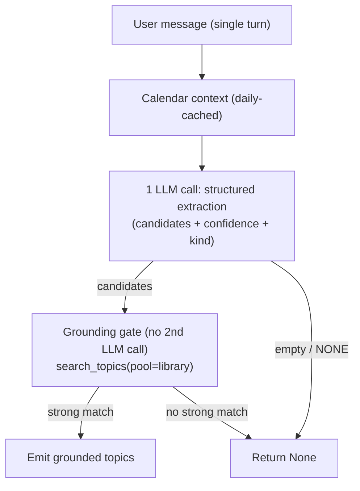

# Appetizer: General Grounded Topic-Finding — Design

**Date:** 2026-06-25
**Status:** Approved design, pending spec review
**Supersedes:** the "appetizer precision" plan (high-precision pipeline with hardcoded parsha/daf-yomi gates)

## Problem

The current appetizer (`server/chat/V2/appetizer/appetizer_service.py`) optimizes for the
wrong objective. It treats parsha and Daf Yomi as *special cases to neutralize* rather than
*queries that deserve a good topic*:

- `_PARSHA_INTENT_RE` → a hardcoded calendar branch that only fires on enumerated phrasings.
- `_DAF_YOMI_SUPPRESS_RE` → hardcoded suppression (returns nothing instead of the tractate topic).
- `_GENERIC_BLOCKLIST` → a hand-maintained denylist of strings.

This is overfit-by-enumeration. New phrasings ("tomorrow's torah passage", "what should I
learn today?", "tanakh yomi", "הרמבם היומי") fall through, and Daf Yomi returns *nothing*
when it could return the tractate topic. CandleKeep guidance (*Writing Effective Tools for
Agents*, *Effective Context Engineering*) confirms the anti-pattern: inject temporal signals
as **context**, not `if/else` branches; add a **validation layer** that returns nothing when
confidence is low — as a general outcome, not enumerated rules.

## Objective

The appetizer has exactly one job: **given any single user message, return the most relevant
grounded Sefaria topic(s), or nothing.** Parsha and Daf Yomi are not special — they are
messages whose best topic needs calendar context to resolve. Better input → cleaner grounding.

### Hard constraints (unchanged)
- User-visible response **under 5 seconds**; fail closed (return `None`) on timeout.
- Topics-only output; no refs.
- The service receives **only the single user message** (no conversation history, no
  selected text). Anything that can't be resolved from the message alone is NONE.

## Evidence: real-traffic taxonomy

Derived from ~600 production prompts. Drives both the few-shot set and the eval set.

| Class | Real examples | Target behavior |
|---|---|---|
| Temporal → calendar | "what is this week's parasha", "today's daf yomi?", "what should I learn today?", "tanakh yomi", "הרמבם היומי" | Resolve via calendar context → **real topic** (parsha, tractate). Not suppression. |
| Concept / life-situation | "show me sources on parenting", "find me sources about suicide", "abortion", "leadership", "צניעות בלבוש", "simcha", "noahide", "shofar", "what are the basic laws of the sabbath?" | High-confidence concept topic. |
| Named entity | "help me learn about achav", "balaam", "tell me about avraham avinu", "Gamaliel", "spiegami la storia di ketia bar shalom" | Person/place topic. Tolerate fuzzy/misspelled ("achav"→Ahab, "Bavaria kama"→Bava Kamma, "tora"→Torah). |
| Bare citation | "Génesis 6:13", "yevamos 76 b", "שולחן ערוך יורה דעה סימן צד", "trattato avoda zara daf 10b" | **NONE** — the user wants that text, not a topic chip. |
| Follow-up / selected-text | "yes please", "explain this tosfos to me", "translate the selected text", "what is this text about?", "?", "כן", "approfondisci" | **NONE** — no topic in the message itself. |
| Greeting / test / noise | "<AUTO TEST> …", "hello", "hi", "i'm sleepy", "facebook", "thank you very much" | **NONE**. |

**Distribution insight:** NONE is the **majority class** in real traffic. The precision gate
is the most important component — over-extraction spams a chip on nearly every turn.

**Multilingual is mandatory.** Prompts arrive in Hebrew, Italian, Spanish, Portuguese, Farsi,
Russian, German, French, Chinese, Turkish. The extractor maps *any* language → a canonical
English topic name for grounding (e.g. "la vaca roja" → Red Heifer; "o que a Parshat Korach
quer nos ensinar" → Parashat Korach).

## Architecture: Hybrid (1 LLM call + grounding gate)



All within the existing 5s `asyncio.wait_for`. Calendar fetch is cached (changes daily), so
after the first call of the day it is ~free and serial latency is one LLM call + parallel
grounding lookups — the same shape as today.

### What gets deleted (the revert)
- `_PARSHA_INTENT_RE` and `_handle_parsha_intent` (the calendar branch).
- `_DAF_YOMI_SUPPRESS_RE` and its suppress branch.
- `_GENERIC_BLOCKLIST` and the blocklist filtering.
- The committed regression tests in `test_appetizer_service.py` that assert *suppression* —
  rewritten to assert *correct topic returned* (or genuine NONE).

### What is kept
- The 5s `asyncio.wait_for` wrapper and fail-closed behavior.
- Parallel grounding lookups (`asyncio.gather`).
- `SefariaClient.search_topics(pool="library")` with its `is_primary` / canonical-title
  ranking (`_get_canonical_titles`).
- `TopicInfo` / `AppetizerResult`, metrics plumbing, Braintrust attachment in `views.py`.
- `get_current_calendar()` on `SefariaClient` (now used as context, not a branch).

## Component 1: Calendar context (daily-cached)

A compact, high-signal context block injected into every extraction call. Pre-computed at
request time from `SefariaClient.get_current_calendar()`, cached in-process with a daily TTL
(keyed by date) so it is fetched at most once per day per process.

Rendered as XML-tagged named fields (not prose), one canonical field per concept:

```
<calendar_context>
date: 2026-06-25
parsha: Chukat-Balak
haftarah: Judges 11:1-33
daf_yomi: Chullin 56
mishnah_yomi: Keilim 3:5-6
rambam_yomi: Ishut 4-6
yerushalmi_yomi: Yevamot 12
tanakh_yomi: Judges 5
</calendar_context>
```

- Field set: render the learning-schedule `calendar_items` Sefaria returns (parsha, haftarah,
  daf yomi, mishnah yomi, rambam, yerushalmi yomi, tanakh yomi). These are the cycles real
  traffic asks for. Skip non-schedule items.
- If the calendar call fails, render `<calendar_context>unavailable</calendar_context>` and
  proceed — temporal queries then simply ground poorly and fall to NONE, never an exception.
- Start with this set; **add fields only on observed failure** (CandleKeep: context rot).

## Component 2: Structured extraction (1 LLM call)

Single tool-forced call (`settings.APPETIZER_MODEL`, `temperature=0`, tool_choice forced).

### Tool schema (self-documenting; enums over floats)

```jsonc
{
  "name": "extract_topics",
  "description": "Identify up to 3 candidate Sefaria library topics from the user's message. \
Provide the user message and use the calendar context to resolve temporal references \
(\"this week's parsha\", \"today's daf yomi\"). Return an empty candidates array when the \
message has no extractable topic (greetings, bare citations, follow-ups like 'explain this' \
or 'yes', or a request about selected/quoted text). Prefer fewer high-confidence candidates \
over more low-confidence ones.",
  "input_schema": {
    "type": "object",
    "properties": {
      "candidates": {
        "type": "array",
        "items": {
          "type": "object",
          "properties": {
            "label": {
              "type": "string",
              "description": "Canonical English topic name, shortest form (e.g. 'Moses' not \
'Moses our Teacher', 'Parashat Balak' for a parsha, 'Chullin' for a tractate). Translate \
non-English messages to the canonical English name."
            },
            "kind": {
              "type": "string",
              "enum": ["person", "place", "concept", "temporal"],
              "description": "person=named individual; place=geographic; concept=theme/law/idea; \
temporal=resolved from calendar context (parsha, daf)."
            },
            "confidence_level": {
              "type": "string",
              "enum": ["high", "low"],
              "description": "high = a clear, specific topic the library plausibly has. \
low = plausible but the message is vague, ambiguous, or underspecified."
            }
          },
          "required": ["label", "kind", "confidence_level"]
        }
      }
    },
    "required": ["candidates"]
  }
}
```

- **NONE = empty `candidates` array** — a first-class, uniform outcome (no null, no separate
  boolean).
- `confidence_level` is the model's cheap **pre-filter**; the grounding API is the true
  arbiter (CandleKeep D1/D2).

### System prompt structure (XML/markdown sections)
- `<task>`: extract candidate library topics from one user message; topics-only product.
- `<precision_heuristic>`: "When in doubt, return fewer candidates with higher confidence, or
  none. A false positive (a chip on a non-topic) is worse than a false negative." NONE is the
  expected output for greetings, bare citations, and follow-ups about prior/selected text.
- `<calendar_context>`: injected block (Component 1).
- `<examples>`: 6 curated few-shot examples, one per structurally distinct class (below).

### Few-shot examples (6, one per class)
1. **Temporal→calendar**: "what's today's daf yomi?" → `[{label:"Chullin", kind:temporal, high}]`
2. **Concept**: "show me sources on parenting" → `[{label:"Parenting", kind:concept, high}]`
3. **Named entity (fuzzy)**: "help me learn about achav" → `[{label:"Ahab", kind:person, high}]`
4. **Non-English concept**: "la vaca roja" → `[{label:"Red Heifer", kind:concept, high}]`
5. **NONE — follow-up/selected-text**: "explain this tosfos to me" → `[]`
6. **NONE — bare citation**: "yevamos 76 b" → `[]`

(Example calendar values are illustrative; the real injected block is current at request time.)

## Component 3: Grounding gate (no 2nd LLM call — the precision)

For each candidate, call `search_topics(pool="library")` (parallel). Accept/reject:

- **Exact or normalized title/slug match, or `is_primary` hit → accept.**
- **Alias-only / weak match → accept only if `confidence_level == "high"`, else drop.**
- **No library-pool match → drop.**

Dropping everything ⇒ return `None`. This single rule replaces both the old blocklist and the
Daf-Yomi suppression: if Daf Yomi's tractate grounds as a topic it ships; if a generic term
doesn't ground, it doesn't. Dedup by slug; preserve model order for ties.

(Semantic re-rank via `english_semantic_search` is a noted future lever, omitted now for the
5s budget.)

## Metrics

Replace suppression-reason codes with general ones, attached to `AppetizerResult.metrics`:
`calendar_cache_hit`, `llm_candidates` (label/kind/confidence), `grounded` / `dropped_weak`
/ `dropped_no_match` per candidate, `total_ms`, `llm_ms`, `searches_ms`. Braintrust attach in
`views.py` is unchanged and receives the richer metadata automatically.

## Making "better" measurable (eval / regression set)

A regression set in `test_appetizer_service.py` built from the real-traffic taxonomy, asserting
the *right topic* (or genuine NONE) — never suppression-of-a-case:

- Temporal: parsha prompt → current parsha topic; daf prompt → current tractate topic
  (calendar mocked to a fixed date so assertions are deterministic).
- Concept: "show me sources on parenting" → `Parenting`; "find me sources about suicide" →
  `Suicide`.
- Entity: "help me learn about achav" → `Ahab`.
- Non-English: "la vaca roja" → Red Heifer / Parah Adumah.
- NONE: "<AUTO TEST> …", "explain this to me", "yevamos 76 b", "yes please" → `None`.
- Gate unit tests on `search_topics` ranking: primary parsha topic beats non-primary alias.
- Budget test: `APPETIZER_TIMEOUT_SECONDS <= 5`; slow calendar/LLM/search paths return `None`.

Mock the LLM and Sefaria HTTP in tests; keep the live smoke checks read-only and optional.

## Why this plan

It removes the overfit special-casing and replaces it with one general mechanism: calendar
context as a signal (not a branch), a single structured extraction, and a grounding gate that
makes "return nothing" a general outcome rather than an enumerated rule. The real-traffic
taxonomy — dominated by NONE, heavily multilingual — is encoded as few-shot examples and an
eval set, so "generally better" is measurable and regression-protected.
